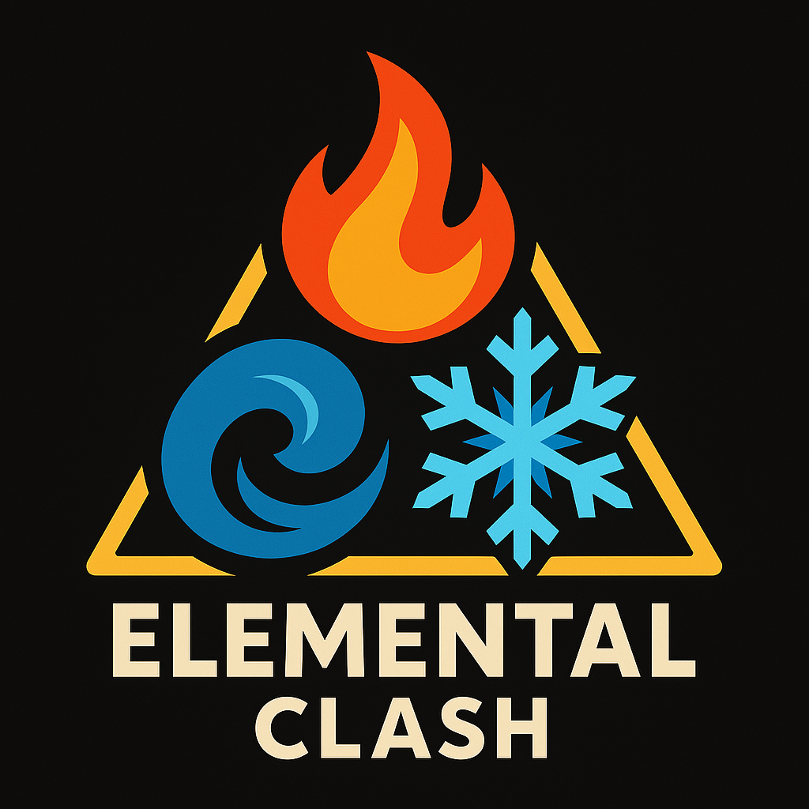

# Elemental Clash ⚡🔥❄️💧

A captivating 3D browser-based game developed for the Computer Graphics course at the University of Aveiro. Experience an immersive elemental card battle in a beautifully rendered 3D environment.



## 🎮 Live Demo

**Play the game:** [https://diogozeca.github.io/Elemental_Clash/](https://diogozeca.github.io/Elemental_Clash/)

**GitHub Repository:** [https://github.com/DiogoZeca/Elemental_Clash](https://github.com/DiogoZeca/Elemental_Clash)

## 🌟 Game Overview

Elemental Clash is an immersive 3D card battle game where players harness the power of Fire 🔥, Ice ❄️, and Water 💧 elements. Navigate through a mystical chamber, approach the enchanted table, and engage in strategic elemental combat against a formidable AI opponent.

### 🎯 Game Features

- **🏛️ Immersive 3D Environment**: Explore a detailed medieval chamber with realistic lighting and shadows
- **⚔️ Strategic Card Combat**: Rock-paper-scissors style gameplay with elemental themes
- **🎨 Stunning Visual Effects**: Dynamic particle systems and elemental animations
- **🎵 Atmospheric Design**: Torch-lit ambiance with fog effects and dynamic lighting
- **🎮 Smooth Controls**: Intuitive first-person movement with pointer lock controls
- **🏆 Victory Celebrations**: Spectacular visual effects upon winning

## 🕹️ How to Play

1. **Enter the Chamber**: Use WASD keys to navigate and mouse to look around
2. **Approach the Table**: Walk to the glowing table in the center of the room
3. **Start the Battle**: Press `E` when prompted to begin the elemental duel
4. **Choose Your Element**: Select Fire, Ice, or Water strategically
5. **Battle Rules**:
   - 🔥 **Fire** melts ❄️ **Ice**
   - ❄️ **Ice** freezes 💧 **Water** 
   - 💧 **Water** extinguishes 🔥 **Fire**
6. **Win the Game**: Defeat your opponent to become an Elemental Master!

## 🛠️ Technical Features

### Graphics & Rendering
- **Three.js WebGL Renderer** with advanced shadow mapping
- **PBR Materials** with normal maps, roughness, and ambient occlusion
- **Dynamic Lighting System** with point lights and directional shadows
- **Particle Effects** for elemental magic visualization
- **Post-processing Effects** including fog and atmospheric rendering

### Game Architecture
- **Modular Design** with separate concerns for physics, controls, and game logic
- **State Management** for seamless game flow and transitions
- **Asset Loading** with progress tracking and error handling
- **Responsive Design** that adapts to different screen sizes

### 3D Assets & Environment
- **Detailed 3D Models** including characters, furniture, and architectural elements
- **Procedural Texturing** with seamless tiling and UV mapping
- **Environmental Storytelling** through carefully crafted scene composition
- **Optimized Performance** with efficient geometry and texture management

## 🚀 Installation & Setup

### Prerequisites
- Modern web browser with WebGL support
- Node.js (for development)

### Local Development
````bash
# Clone the repository
git clone https://github.com/DiogoZeca/Elemental_Clash.git

# Navigate to project directory
cd Elemental_Clash

# Install dependencies
npm install

# Start development server
npm run dev

# Build for production
npm run build